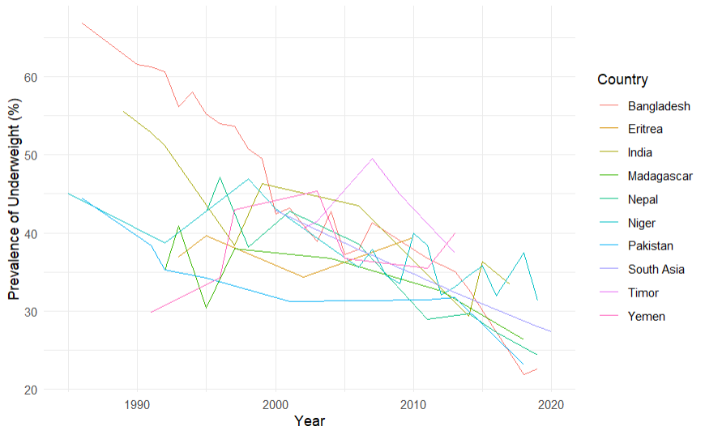

# Introduction

Hunger has been a concern for generations and has continued to plague hundreds of millions of people around the world. Although many efforts have been devoted to reduce hunger, challenges such as growing competitions for natural resources, emerging climate changes and natural disasters, poverty, illiteracy, and diseases are posing threats to food security and intensifying the hunger crisis.

Since the adoption of the *United Nations Millennium Declaration* in 2001 to improve human well-being by alleviating hunger, poverty, and disease, many efforts have been devoted to achieve one of the targets of the *Millennium Development Goals (MDGs)* ---to reduce the prevalence of hunger by half between 1990 and 2015. Many studies have revealed the possible directions for scientists to boost food production to meet the food demand of world population. It should be noted that although the world's population is still increasing, the pace of increase is in fact getting slower and will even start to decrease in the next few decades. The population (medium variant) in more developed regions and eastern Asian countries would decline after the years 2035--2045 (UN, Citation2009; FAO, Citation2010). Nevertheless, numerous people around the world are still suffering from hunger and lack of basic food intake necessary for survival and productive lives. [@Wu2013]

## What is the Global Hunger Index?

The Global Hunger Index is a tool that measures and tracks hunger nationally, regionally and globally. The report is prepared by Concern Worldwide and the European NGO and our Alliance2015 partner Welthungerhilfe.

Scores are calculated and assigned to countries around the world to assess progress and setbacks in combating hunger worldwide, and to give a picture of hunger across different regions and the world.

According to the GHI website, the index is "designed to raise awareness and understanding of the struggle against hunger, provide a way to compare levels of hunger between countries and regions, and to call attention to those areas of the world where hunger levels are highest and where the need for additional efforts to eliminate hunger is greatest".

## How is the GHI calculated?

The score of a country is calculated based on four indicators - **undernourishment**, **child stunting**, **child wasting**, and **child mortality**.

Each indicator is given a standardised score on a 100-point scale based on the highest observed level for the indicator on a global scale in recent decades. The scores are then aggregated to calculate the GHI score for each country. [@concernWhatGlobal]

In the following we will be exploring the data set *"Global Hunger Index"*, from [**kaggle**](https://www.kaggle.com/datasets/whenamancodes/the-global-hunger-index). [@kaggleGlobalHunger]

# About the Dataset

Having a diet which is both sufficient in terms of energy (caloric) requirements and diverse to meet additional nutritional needs is essential for good health. Undernourishment, especially in children and mothers, is a leading risk factor for death and other health consequences.

The UN has set a global target as part of the Sustainable Development Goals to **"end hunger by 2030"**. Currently we are far from reaching this target.

## Measures of undernourishment and under nutrition in children

There are three key physiological measures of undernourishment and under nutrition in children. The measures discussed and visualized in the sub-sections below are:

-   **Stunting** -- being 'too short for one's age';

-   **Wasting** -- being 'dangerously thin for one's height'; and

-   **Underweight** -- low weight-for-age in children.

## Indicators

The four indicators are:

-   **Undernourishment**: the proportion of undernourished people as a percentage of the population (reflecting the share of the population with insufficient caloric intake);

-   **Child wasting**: the proportion of children under the age of five who suffer from wasting (low weight for their height, reflecting acute under nutrition);

-   **Child stunting**: the proportion of children under the age of five who suffer from stunting (low height for their age, reflecting chronic under nutrition); and

-   **Child mortality**: the mortality rate of children under the age of five (partially reflecting the fatal synergy of inadequate nutrition and unhealthy environments).

## Categories

Scores are categorized in the following way:

-   **Extremely alarming**: 50 or higher

-   **Alarming**: 35 to 50

-   **Serious**: 20 to 35

-   **Moderate**: 10 to 20

-   **Low**: below 10

# Presentation of the problem

The Global Hunger Index data set, comprises four tables that are pivotal for analyzing and understanding the global hunger situation. The data set includes information related to the Global Hunger Index (GHI) scores from various countries, spanning multiple years.

The first table, "global-hunger-index.csv" provides an overview of GHI scores for different countries and years.

The second table, "share-of-children-underweight.csv" provides data on the share of children underweight in various countries.

The third table, "share-of-children-with-a-weight-too-low-for-their-height-wasting.csv" presents information about the share of children with a weight too low for their height, also known as wasting.

And the final table "share-of-children-younger-than-5-who-suffer-from-stunting" presents information as the name suggests.

With these tables, we will perform various analyses to gain insights into global hunger and child malnutrition. We will examine GHI scores over time and compare the prevalence of underweight, wasting, and stunting among children across countries and years.

```{r setup, include=F}
knitr::opts_chunk$set(echo = TRUE)
library(tidyverse)
library(dplyr)     
library(ggplot2)   
library(DT)          
library(knitr)
library(gridExtra)
```

# Presentation of the data

## The data set:

```{r}
csv_dir <- paste0(getwd(), "/archive")
ghi <- read.csv(paste0(csv_dir, "/global-hunger-index.csv")) %>% data.frame()
underweight <- read.csv(paste0(csv_dir, "/share-of-children-underweight.csv"))%>% data.frame()
wasting <- read.csv(paste0(csv_dir, "/share-of-children-with-a-weight-too-low-for-their-height-wasting.csv"))%>% data.frame()
stunting <- read.csv(paste0(csv_dir, "/share-of-children-younger-than-5-who-suffer-from-stunting.csv"))%>% data.frame()

datatable(ghi, rownames = F, filter = "top", caption = "Global Hunger Index", options = list(searching = F, pageLength =5 , lengthMenu=c(5, 10, 15, 20), scrollX=T, autoWidth=T))

```

```{r}
datatable(underweight, rownames = F, filter = "top", caption = "Share of underweight children ", options = list(searching = F, pageLength =5 , lengthMenu=c(5, 10, 15, 20), scrollX=T, autoWidth=T))
```

```{r}
datatable(wasting, rownames = F, filter = "top", caption = "Share of children with a weight too low for their height - wasting", options = list(searching = F, pageLength =5 , lengthMenu=c(5, 10, 15, 20), scrollX=T, autoWidth=T))
```

```{r}
datatable(stunting, rownames = F, filter = "top", caption = "Share of children younger than 5 who suffer from stunting", options = list(searching = F, pageLength =5 , lengthMenu=c(5, 10, 15, 20), scrollX=T, autoWidth=T))
```

## Content description

The **"global hunger index"** table consists of:

```{r}
colnames(ghi)
```

The **"share of underweight children"** table consists of:

```{r}
colnames(underweight)
```

The **"share of children with a weight too low for their height - wasting"** table consists of:

```{r}
colnames(wasting)
```

The **"share of children younger than 5 who suffer from stunting"** consists of:

```{r}
colnames(stunting)
```

### Meaning of the variables

1.  **Entity**: refers to the name or label of a specific entity, such as a country or region.

2.  **Code:** represents a code or abbreviation associated with the corresponding entity. It provides a standardized identifier for the entity, such as the ISO country code. For example, "AFG" represents Afghanistan.

3.  **Year:** indicates the specific year to which the data corresponds. It represents a unit of time, it has numerical value representing a calendar year. It is used to organize and categorize the data based on the time period to which it corresponds.

4.  **Global Hunger Index (2021):** This column contains the actual GHI values for each entity (country) in the given year. The unit of the Global Hunger Index is a dimensionless score, often represented as a number. It serves as an indicator of the severity of hunger, with higher values indicating higher levels of hunger and lower values indicating lower levels of hunger.

5.  **Prevalence of underweight, weight for age (% of children under 5)**: It represents the proportion of children under 5 years old who are classified as underweight based on weight-for-age measurements. The value is expressed as a percentage.

6.  **Prevalence of wasting, weight for height (% of children under 5)**: It represents the proportion of children under 5 years old who are classified as wasted based on weight-for-height measurements. The value is expressed as a percentage.

7.  **Prevalence of stunting, height for age (% of children under 5)**: It represents the proportion of children under 5 years old who are classified as stunted based on height-for-age measurements. The value is expressed as a percentage.

# Data aggregation

### *The average Global Hunger Index per country*

```{r}
 avg_ghi <- ghi %>%
  group_by(Entity) %>%
  summarize(Average_Global_Hunger_Index = paste0(round(mean(Global.Hunger.Index..2021.),2),"%"))
avg_ghi %>% datatable(options = list(searching = F, pageLength =5))


```

### *The average prevalence of underweight children for each country over the years*

```{r}
avg_underweight <- underweight %>% 
  group_by(Entity) %>% 
  summarize(Average_Prevalence = paste0(round(mean(Prevalence.of.underweight..weight.for.age....of.children.under.5.),2),"%")) 
avg_underweight %>% 
  datatable(options = list(searching = F, pageLength =5))
```

### *The minimum and maximum prevalence of underweight children across the years*

```{r}
min_max_underweight <- underweight %>% 
  group_by(Entity) %>%
  summarize(Min_Prevalence = paste0(round(min(Prevalence.of.underweight..weight.for.age....of.children.under.5.),2), "%"), Max_Prevalence = paste0(round(max(Prevalence.of.underweight..weight.for.age....of.children.under.5.),2), "%")) 
min_max_underweight %>%
  datatable(options = list(searching = F, pageLength =5))
```

### *The average prevalence of wasting for each county over the years*

```{r}
avg_wasting <- wasting %>% 
  group_by(Entity) %>% 
  summarize(Average_Prevalence = paste0(round( mean(Prevalence.of.wasting..weight.for.height....of.children.under.5.),2), "%")) 
avg_wasting %>% datatable(options = list(searching = F, pageLength =5))
```

### *The change in wasting prevalence over the time*

This can provide insights into whether the prevalence has increased or decreased.

```{r}
change_in_wasting <- 
  wasting %>% 
  group_by(Entity) %>%
  summarize(Change_in_wasting_prevalence =paste0(round( last(Prevalence.of.wasting..weight.for.height....of.children.under.5.) - first(Prevalence.of.wasting..weight.for.height....of.children.under.5.),2),"%"))

change_in_wasting %>%datatable(options = list(searching = F, pageLength =5))
  
```

### *The average prevalence of stunting for each country over the years*

```{r}
avg_stunting <- 
  stunting %>%
  group_by(Entity) %>% 
  summarize(Average_Prevalence = paste0(round(mean(Prevalence.of.stunting..height.for.age....of.children.under.5.), 2), "%"))

avg_stunting %>%datatable(options = list(searching = F, pageLength =5))
  
```

### *The number of undernourished people in each country and each year*

```{r}
joined_data <- ghi %>% 
  inner_join(underweight, by=c("Entity", "Year")) %>% 
  inner_join(wasting, by=c("Entity", "Year")) %>%
  inner_join(stunting, by=c("Entity", "Year"))

undernourished_ppl <- 
  joined_data %>% 
  group_by(Entity, Year) %>% 
  summarize(Total_prevalence_underweight = paste0(round(sum(Prevalence.of.underweight..weight.for.age....of.children.under.5.), 2), "%"),
            Total_prevalence_wasting = paste0(round(sum(Prevalence.of.wasting..weight.for.height....of.children.under.5.),2), "%"),
            Total_prevalence_stunting = paste0(round(sum(Prevalence.of.stunting..height.for.age....of.children.under.5.),2), "%")
            ,.groups="drop"
              )

undernourished_ppl %>%
  datatable(options = list(searching = F, pageLength =5))
  
```

# Exploratory data analysis (EDA)

## *Global Hunger Index per country for the year 2021 (top 20)*

```{r}

# Filter the data for the year 2021
ghi_2021 <- ghi %>%
  dplyr::filter(Year == 2021)

# Get the top 20 countries with the highest GHI values
top_20_countries <- ghi_2021 %>%
  top_n(20, Global.Hunger.Index..2021.)

# Create the histogram plot
plot <- ggplot(top_20_countries, aes(x = reorder(Entity, -Global.Hunger.Index..2021.), y = Global.Hunger.Index..2021.)) +
  geom_bar(stat = "identity", fill = "#CD5C5C", color = "white") +
  labs(title = "Top 20 Countries by Global Hunger Index (2021)",
       x = "Country",
       y = "Total GHI") +
  theme_minimal() +
  theme(axis.text.x = element_text(angle = 45, hjust = 1))

# Display the plot
print(plot)
```

As we can see, only one country is extremely alarming, and that is Somalia. Countries from Yemen to Timor are alarming, while the rest are specified under the "serious" category.

## *Hunger Index Distribution plot between 2000 and 2021*

```{r}

col <- c(2000, 2006, 2012, 2021)

df <- ghi %>%
  filter(ghi$Year %in% col) %>% data.frame()

# Create the violin plot

  df %>% ggplot( aes(x = ghi$Year, y = ghi$Global.Hunger.Index..2021.)) +
  geom_violin(fill = "#CD5C5C", color = "white") +
  labs(x = "Year", y = "Hunger Index") +
  theme_minimal()
```

As we can see, the peak of hunger was experienced in the period from 2010 to 2012 approximately, and then it has been steadily decreasing until today.

## *Top 10 countries with highest prevalence of underweight children over the years*

```{r, include=F}

# Filter the data for the top 10 countries
top_10_countries <- underweight %>%
  group_by(underweight$Entity) %>%
  summarize(Average_Prevalence = mean(Prevalence.of.underweight..weight.for.age....of.children.under.5.)) %>%
  top_n(10)
```

```{r, error=T, warning=F}
# Filter the data for the top 10 countries only
filtered_data <- underweight %>%
  filter(underweight$Entity %in% top_10_countries$`underweight$Entity`) %>% data.frame()

# Create the line plot
ggplot2::ggplot(filtered_data, aes(x = filtered_data$Year, y = filtered_data$Prevalence.of.underweight..weight.for.age....of.children.under.5., color = filtered_data$Entity)) +
  geom_line(aes(group = filtered_data$Entity)) +
  labs(x = "Year", y = "Prevalence of Underweight (%)", color = "Country") +
  theme_minimal()

```


Here we can see that Bangladesh had the highest prevalence before 1990, but then it steadily decreased, unlike Yemen, which grew slowly over the years. In the rest of the countries we can see that there used to be a higher prevalence of underweight among children, but over the years it has decreased.


# Conclusion
According to the given data and a more detailed analysis, we can see that the numbers of hunger, abnormal weight, stunting, and wasting were worse in the past years, and as time goes by, new solutions are found to solve the problem of hunger and for all children to live in normal conditions and be healthy.

# References
